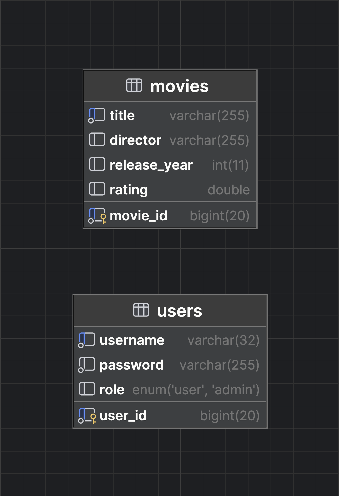

# Movie Library REST API

## Overview

Movie Library is a secure RESTful Spring Boot application for managing a catalog of movies. In addition to standard CRUD operations, the system enriches movies with rating data retrieved from an external movie information service (OMDb API). The rating enrichment is performed asynchronously, ensuring that movie creation requests remain fast and non-blocking.

The application demonstrates clean architecture, role-based authorization, asynchronous processing, and comprehensive test coverage.

---

## Core Features

### Movie Management

- Create, retrieve, update, and delete movies
- Each movie contains:
  - ID (auto-generated)
  - Title (required)
  - Director
  - Release year
  - Rating (initially nullable)
- Validation for input data (e.g. required title, reasonable release year)

### External Rating Enrichment

- When a movie is created, the system queries the OMDb API using the movie title
- If a rating is available, it is extracted and saved to the local movie record
- The enrichment process runs asynchronously and does not block the API request

### User Management

- User entity with roles: `ADMIN` and `USER`
- Role-based authorization rules enforced at method level
- Ownership checks for user-specific operations

---

## Security

The application is secured using Spring Security with role-based authorization.

### Roles

- **ADMIN**
  - Full CRUD access to movies
  - Full access to user management

- **USER**
  - Read-only access to movie data
  - Access only to their own user information

### Authorization Model

- Method-level security via `@PreAuthorize`
- Custom authorization helper used for:
  - Authentication validation
  - Admin-only access checks
  - Owner-or-admin access checks

Security logic is centralized and fully covered by unit and controller tests.

---

## Asynchronous Processing

- Movie rating enrichment is executed in the background
- The movie creation endpoint returns immediately
- External API latency does not impact request performance

This design ensures responsiveness while still providing enriched data.

---

## Architecture & Design Decisions

- Layered architecture (Controller → Service → Repository)
- DTOs and mappers used to separate API models from persistence models
- Centralized exception handling for consistent error responses
- External API integration isolated behind service abstractions
- Designed for extensibility (e.g. token-based authentication can be added without structural changes)

---

## Database Schema

The database schema below illustrates the relational structure of the system,
including users, roles, and movies. It reflects the authorization model
and supports the defined access rules.



---

## Tech Stack

- Java 17+
- Spring Boot
- Spring Web
- Spring Security
- Spring Data JPA / Hibernate
- MariaDB
- OMDb API
- Swagger / OpenAPI
- JUnit 5 & Mockito

---

## Testing

The project includes extensive test coverage:

- Unit tests for services, mappers, validation helpers, and security helpers
- Controller tests with mocked dependencies and security context
- Authorization paths (ADMIN vs USER vs OWNER) are explicitly tested

Test coverage exceeds typical academic requirements and focuses on correctness and security behavior.

---

## API Documentation

Swagger UI is available once the application is running:

```
http://localhost:8080/swagger-ui/index.html
```

All endpoints, request bodies, and response models are documented.

---

## Setup & Installation

### Prerequisites

- Java 17+
- MariaDB

### Steps

1. Clone the repository
   ```bash
   git clone <[repository-url](https://github.com/todorkrushkov/movie-library)>
   ```

2. Initialize the database

    The project includes SQL scripts for database creation and initial data population.
   - Create the database schema from: `db/create.sql`
   - Insert initial data from: `db/inserts.sql`


3. Configure application properties

   Update application.properties with your local configuration:
      ```properties
      spring.datasource.url=jdbc:mariadb://localhost:3306/movie_library
      spring.datasource.username=your_db_user
      spring.datasource.password=your_db_password

      omdb.api.key=YOUR_OMDB_API_KEY
      ```

4. Run the application from your IDE or using:
   ```bash
   ./gradlew bootRun
   ```
   
5. Access the API

   - Swagger UI:
     ```
     http://localhost:8080/swagger-ui/index.html
     ```

     Swagger provides full documentation of all available endpoints,
     request/response models, and authorization rules.

   - Postman:
     ```
     http://localhost:8080/api
     ```

---

---

## Technical Documentation

A detailed explanation of the system architecture, security model, and asynchronous processing
is available in the following document:

- **[TECHNICAL_DOCUMENTATION.md](TECHNICAL_DOCUMENTATION.md)**

The document covers:
- Overall system architecture and layering
- Authentication and authorization flow
- Role-based access control (ADMIN / USER)
- Asynchronous movie rating enrichment
- Key architectural decisions and trade-offs

---

## Contributors

For further information, questions, or feedback, feel free to get in touch:

| Name           | Email                        | GitHub                           |
|----------------|------------------------------|----------------------------------|
| Todor Krushkov | todorkrushkov.1304@gmail.com | https://github.com/todorkrushkov |

---

## Notes
- This project was developed as part of the **Java Alpha program at Telerik Academy**.
- The application is designed to prioritize clarity, correctness, and testability
- Security and asynchronous behavior are implemented explicitly rather than implicitly
